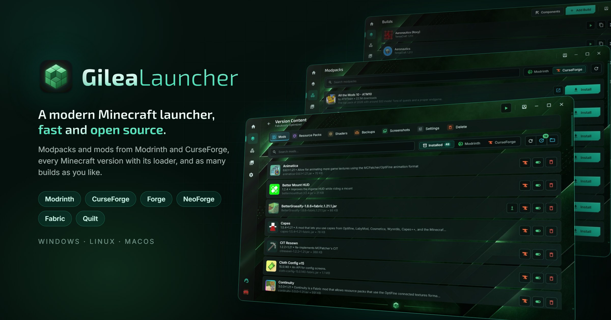
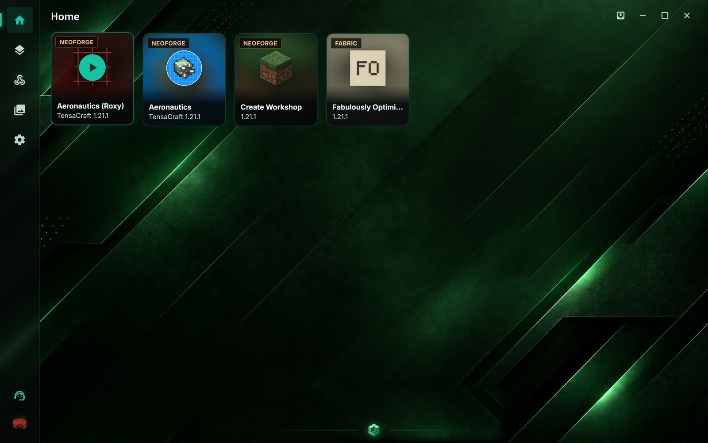
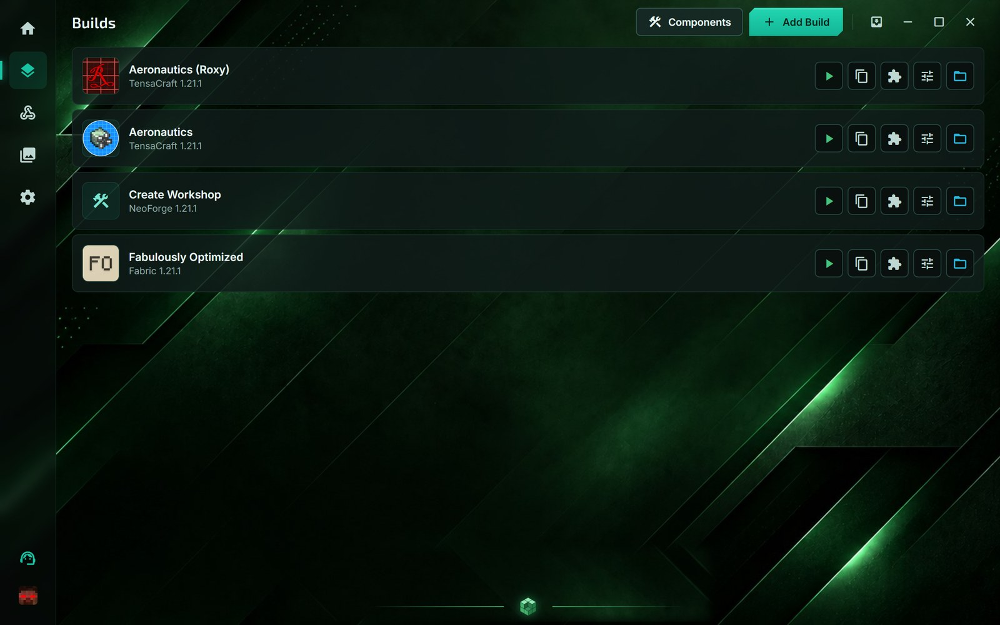
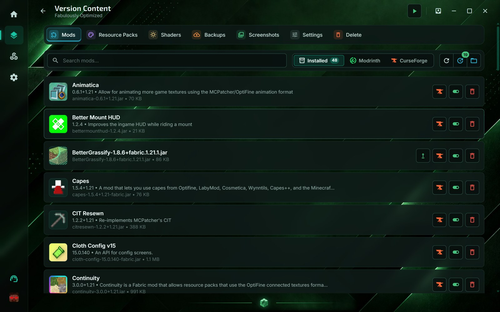
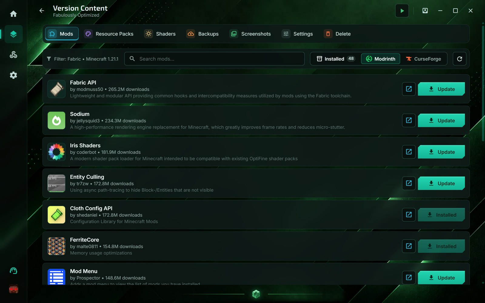
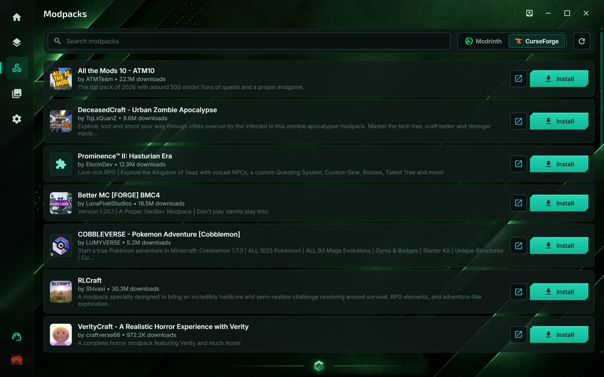
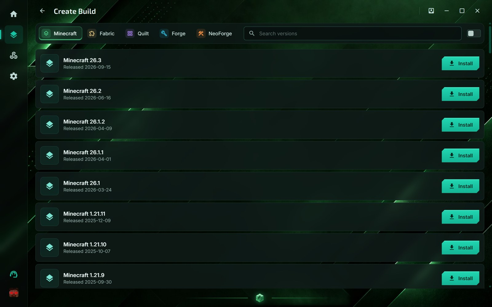
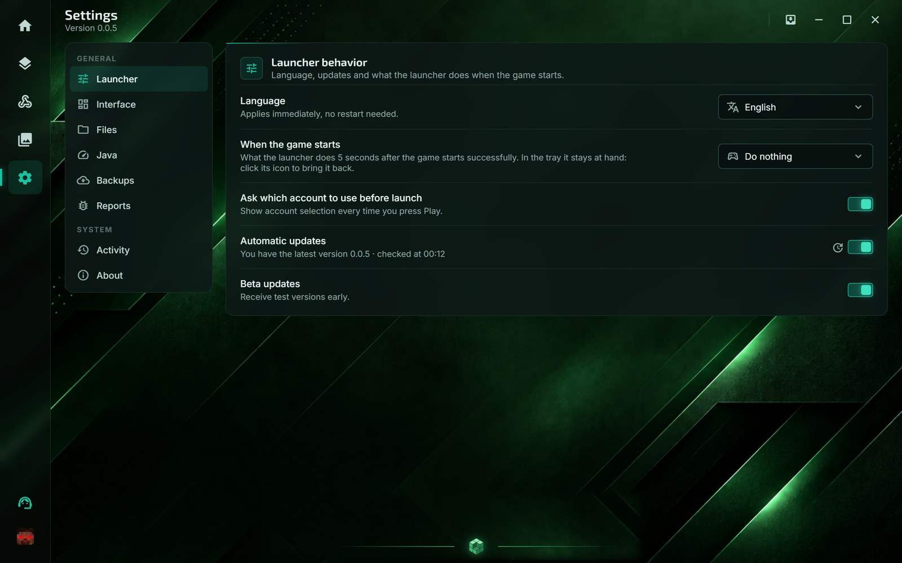
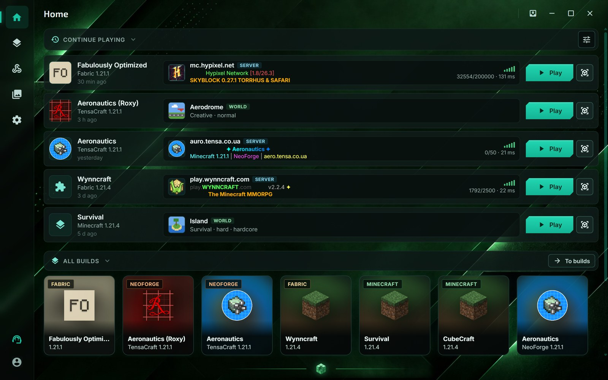

<p align="right"><a href="README.md">English</a> · <b>Українська</b></p>

<p align="center">
  
</p>

<p align="center">
  Лаунчер Minecraft для Windows, Linux і macOS.<br>
  <a href="https://github.com/TensaCraft/GileaLauncher/releases/latest"><b>Завантажити</b></a> ·
  <a href="https://discord.com/invite/mftAjQA4Pp">Discord</a>
</p>

<p align="center">
  <a href="https://github.com/TensaCraft/GileaLauncher/releases"></a>
  <a href="https://github.com/TensaCraft/GileaLauncher/releases/latest"></a>
  <a href="https://github.com/TensaCraft/GileaLauncher/stargazers"></a>
</p>

## Можливості

- Встановлює будь-яку версію Minecraft, а також Forge, NeoForge, Fabric і Quilt.
- Модпаки й моди з Modrinth: пошук, встановлення, оновлення.
- Модпаки, моди, ресурспаки й шейдери з CurseForge: пошук, встановлення разом із залежностями, оновлення.
- Кілька збірок поруч, і в кожної свої світи, моди й налаштування.
- «Продовжити гру» на Головній: для кожної недавньої збірки — останній сервер (з MOTD, гравцями й пінгом) або світ. Повернутися туди можна одним кліком.
- Акаунти Microsoft і офлайн-профілі; у збірки може бути власний акаунт.
- Java для гри підбирається й завантажується автоматично.
- Бекапи світів.
- Ярлик збірки на робочому столі.

## Скриншоти

<table>
  <tr>
    <td><br><sub>Головна: ваші збірки, гра в один клік</sub></td>
    <td><br><sub>Кілька збірок поруч</sub></td>
  </tr>
  <tr>
    <td><br><sub>Моди збірки та їхні оновлення</sub></td>
    <td><br><sub>Моди з Modrinth і CurseForge</sub></td>
  </tr>
  <tr>
    <td><br><sub>Модпаки встановлюються як збірки</sub></td>
    <td><br><sub>Будь-яка версія Minecraft зі своїм лоадером</sub></td>
  </tr>
  <tr>
    <td><br><sub>Налаштування</sub></td>
    <td><br><sub>Продовжити гру: останній сервер чи світ, повернення в один клік</sub></td>
  </tr>
</table>

## Редакції

| Редакція | Що всередині | Файли |
|---|---|---|
| **GileaLauncher** | усе, що описано вище | `GileaLauncher-standard…` |
| **GileaLauncher + TensaCraft** | те саме, а ще збірки серверів TensaCraft на Головній | `GileaLauncher-tensa…` |

Кожна редакція оновлюється лише до новішої версії тієї самої редакції. Щоб перейти на іншу редакцію, завантажте її файл. Обидві редакції мають спільні налаштування, профілі й збірки, тож нічого не загубиться.

## Встановлення

Файли лежать на сторінці [Releases](https://github.com/TensaCraft/GileaLauncher/releases/latest). Нижче `standard` — це назва редакції; для TensaCraft замість неї `tensa`.

### Windows 10 і 11

- **`GileaLauncher-standard-Setup.exe`** — інсталятор. Права адміністратора не потрібні. Додає лаунчер у меню «Пуск».
- **`GileaLauncher-standard.exe`** — портативна версія без встановлення: просто запустіть її.

Лаунчер поки не підписаний, тому Windows може показати вікно «Windows захистила ваш ПК» (Windows protected your PC). Натисніть «Докладніше» (More info), а потім «Усе одно запустити» (Run anyway).

### Linux (x86_64)

- **`GileaLauncher-standard-x86_64.AppImage`** — рекомендований варіант. Усе потрібне вже всередині, тож нічого доставляти не треба. Зробіть файл виконуваним і запустіть:
  ```bash
  chmod +x GileaLauncher-standard-x86_64.AppImage
  ./GileaLauncher-standard-x86_64.AppImage
  ```
  У файловому менеджері те саме робиться так: відкрийте властивості файлу, дозвольте запускати його як програму й двічі клацніть по ньому. На мінімальній системі без утиліти `fusermount` AppImage про це повідомить; тоді запускайте його з `--appimage-extract-and-run`.
- **`GileaLauncher-standard-x86_64`** — менший звичайний виконуваний файл. Він використовує системний WebKitGTK 4.1, якого часто немає за замовчуванням (в Ubuntu: `sudo apt install libwebkit2gtk-4.1-0`).

### macOS

**`GileaLauncher-standard-universal.dmg`** — для Apple Silicon та Intel. Відкрийте образ і перетягніть GileaLauncher у «Програми» (Applications).

Лаунчер поки не нотаризований Apple, тому macOS блокує перший запуск. Відкрийте «Системні параметри» → «Приватність і безпека» (System Settings → Privacy & Security) і натисніть «Усе одно відкрити» (Open Anyway) біля повідомлення про GileaLauncher. На macOS 14 і старіших клацніть GileaLauncher у «Програмах» з натиснутою клавішею Control і виберіть «Відкрити». Якщо macOS пише, що програму пошкоджено, виконайте в Терміналі:

```bash
xattr -dr com.apple.quarantine /Applications/GileaLauncher.app
```

## Оновлення

Лаунчер сам перевіряє нові версії своєї редакції й пропонує оновитися. Щоб отримувати бета-версії, увімкніть «Бета-оновлення» в налаштуваннях лаунчера. Оновлення ніколи не чіпають ваші дані.

## Де зберігаються дані

Під час першого запуску майстер налаштування показує, де зберігатимуться налаштування та ігри, і дає вибрати іншу теку. За замовчуванням:

| Система | Налаштування | Ігри |
|---|---|---|
| Windows | `%LOCALAPPDATA%\GileaLauncher` | `%APPDATA%\GileaLauncher` |
| Linux | `~/.config/GileaLauncher` | `~/.local/share/GileaLauncher` |
| macOS | `~/Library/Application Support/GileaLauncher` | `~/Library/Application Support/GileaLauncher/minecraft` |

## Підтримка

- Питання й допомога: [Discord](https://discord.com/invite/mftAjQA4Pp).
- Якщо гра вилітає, натисніть «Надіслати звіт» у вікні помилки.
- Помилки й пропозиції: [Issues](https://github.com/TensaCraft/GileaLauncher/issues).

Що лаунчер зберігає й надсилає: [docs/uk/privacy.md](docs/uk/privacy.md).

Для розробників: [docs/uk/](docs/uk/README.md).

## Ліцензія

[MIT](LICENSE) © GIGABAIT. Шрифти Inter, Exo 2 і JetBrains Mono поширюються за ліцензією SIL OFL 1.1, Material Icons — за Apache 2.0 ([assets/fonts/licenses](assets/fonts/licenses)).

GileaLauncher — неофіційний лаунчер, не пов'язаний з Mojang чи Microsoft. Minecraft — торгова марка Mojang AB.

CurseForge працює лише в офіційних версіях лаунчера: CurseForge видав для нього API-ключ, і релізні версії отримують його із секрету. Форку чи власноруч зібраному лаунчеру потрібен свій ключ ([заявка в CurseForge](https://console.curseforge.com/)), заданий у `CURSEFORGE_API_KEY` під час збирання чи запуску; без ключа CurseForge не показується. GileaLauncher не пов'язаний з CurseForge чи Overwolf.
